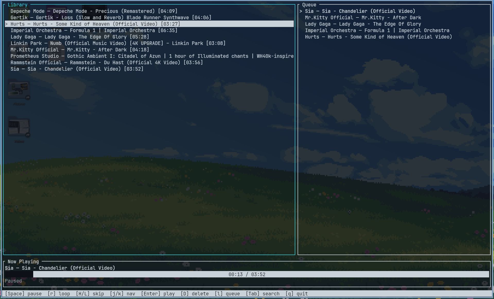
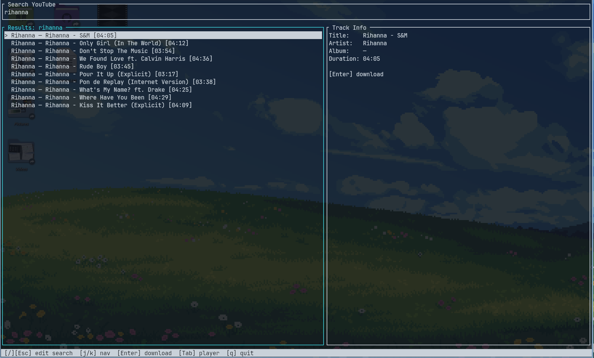

# mustui

A terminal music player that searches YouTube via yt-dlp, downloads audio locally, and plays it back through your system audio device.

## Requirements

- Rust 
- [yt-dlp](https://github.com/yt-dlp/yt-dlp) installed and available on `PATH`

No ffmpeg or ffprobe required. yt-dlp is told to grab the native audio stream. 

The binary will be at `target/release/mustui`.

## Preview



Mustui inherits your terminal feel-and-look.

## Building

```
cargo build --release
```

## Running

```
cargo run --release
```

Downloaded audio files and JSON metadata sidecars are stored under your audio directory in a `mustui/` subdirectory, with a fallback to `~/Music/mustui/` on Linux if no audio directory is available. Logs are written to `mustui.log` in your local state directory.

## How it works

The app follows the Elm/TEA (The Elm Architecture) pattern:

1. Input events, background task results, and timer ticks are translated into a `Message`.
2. `update()` receives the message, mutates the `Model`, and returns the next `Message` to chain (or `Message::None` to stop).
3. `ui::draw()` renders the current `Model` to the terminal.

Background work (searching and downloading) runs on plain OS threads spawned via `Task::spawn`. Each thread sends its result back through an `mpsc` channel, which the main loop drains on every tick.

Audio decoding uses Symphonia (via rodio). Downloaded files are cached on disk; subsequent plays skip the download and use the cached file. If a cached file fails to decode it is deleted automatically so the next attempt re-downloads it.

## Keybindings

### Search view

| Key | Action |
|-----|--------|
| `/` or `Esc` (from results) | Focus search input |
| `Enter` (in input) | Submit search |
| `Esc` (in input) | Go to results |
| `j` / `k` or arrows | Navigate results |
| `Enter` (on result) | Download track |
| `Tab` | Switch to player view |
| `q` | Quit |

### Player view

| Key | Action |
|-----|--------|
| `Space` | Pause / resume |
| `r` | Cycle loop mode (off / one / all) |
| `H` / `L` | Skip to previous / next track in queue |
| `h` / `l` or arrows | Focus library / queue panel |
| `j` / `k` or arrows | Navigate focused panel |
| `Enter` (library) | Add to queue and play |
| `d` (queue) | Remove selected track from queue (not allowed on currently playing track) |
| `D` (library) | Delete track from disk and library |
| `Tab` | Switch to search view |
| `q` | Quit |

## Crate dependencies

| Crate | Purpose |
|-------|---------|
| ratatui + crossterm | Terminal UI rendering and raw-mode input |
| rodio + symphonia | Audio playback and decoding (m4a, webm, opus, mp3) |
| serde + serde_json | Serialising track metadata to/from JSON sidecars on disk |
| thiserror + anyhow | Typed errors for internal code; anyhow for the top-level result |
| tracing + tracing-subscriber + tracing-appender | Structured logging to a non-blocking file appender |
| directories | Platform-correct paths for music and log directories |

## File structure

```
src/
├── main.rs              # Entry point: initialises logging, audio, backend, terminal, starts app
├── app.rs               # Event loop, key-to-message translation, dispatch chaining
├── msg.rs               # Message enum: every event and action in the system
├── state.rs             # Model (all application state) and UI enums (View, AudioStatus, LoopMode, ...)
├── update.rs            # Reducer: (Model, Message) -> next Message; all state mutation lives here
├── task.rs              # Task<T>: spawns a thread, runs a blocking closure, sends result over mpsc
├── audio.rs             # Rodio wrapper: play, pause, stop, tick (polls position and end-of-track)
├── domain.rs            # Shared data types: Track, TrackId, SearchResults, PlaylistEntry, ThumbnailUrl
├── error.rs             # CoreError enum and Result<T> alias
├── logging.rs           # Tracing setup: rolling log file via tracing-appender
├── terminal.rs          # Thin wrappers around ratatui::init() and ratatui::restore()
├── data.rs              # Module declaration for the data layer
├── data/
│   ├── client.rs        # Backend struct: resolves the music directory path on startup
│   ├── library.rs       # Local library: scan JSON sidecars, save sidecars, delete tracks
│   └── ytdlp.rs         # yt-dlp driver: search (--dump-json) and ensure_local_audio (download + cache)
└── ui/
    ├── mod.rs           # Dispatches drawing to the active view
    ├── player.rs        # Player view: library list, queue, now-playing bar, progress gauge
    ├── search.rs        # Search view: search bar, results list, track info panel
    └── theme.rs         # Style helpers: normal, bold, dimmed, reversed, accent
```
